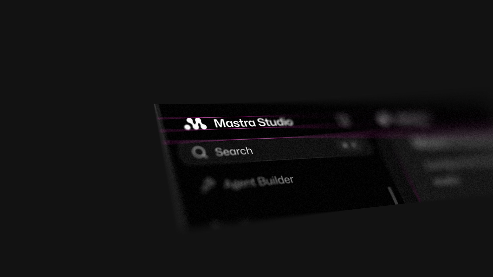

# Isomock

<p>
  <a href="https://isomock.justin-levine.workers.dev"></a>
  <a href="https://github.com/jal-co/isomock/blob/main/LICENSE"></a>
  <a href="https://github.com/jal-co/isomock/commits/main"></a>
</p>

I always was inspired by the cool images I see companies like polar use for their blog posts... so I thought, why not create a tool that lets me turn a flat screenshot into a tilted, depth-of-field mockup. I have used sites like ultramock, but found that while it is great for comprehensive mockups (and I reccomend you try it), I needed something really simple. Just Drop in an image, angle it, pick what stays sharp, and export a PNG.

**Live at [isomock.justin-levine.workers.dev](https://isomock.justin-levine.workers.dev)**



## Features

- **Tilt** the screenshot in 3D by dragging it, or with the orientation gizmo. Field of view runs from near-isometric (5°) to strong perspective (90°)
- **Frame** the shot directly on the canvas: pinch or Ctrl/⌘-scroll to zoom around the cursor, two-finger scroll to pan. What you frame is what exports
- **Focus** on any point of the screenshot. Blur grows with depth away from it, with an adjustable sharp band
- **Finish** with film grain and a feathered edge that fades the screenshot into the background
- **Match screenshot** sets the background to the image's edge color in one click
- Export PNG or JPG at 2K, 4K, or 8K, with an optional transparent background
- Save and import settings as JSON

## Run

```sh
npm install
npm run dev
```

## Deploy

The app is a static build served by Cloudflare Workers static assets (`wrangler.jsonc`). A small Worker in `worker/index.js` runs only for `/` and rewrites the social meta tags to point at `public/og.jpg`.

```sh
npm run deploy
```

## How it works

Everything renders in one WebGL2 fragment shader. For each output pixel it casts a ray from the camera to the screenshot's plane, which gives the texture coordinate and the depth at that pixel. The blur radius comes from how far that depth is from the focus point's depth. The shader then averages up to 64 samples on a golden-angle disc, recasting the ray for each one so the blur follows the plane's perspective. Mipmapped texture lookups keep far-away detail from aliasing, and grain is seeded per output pixel, so exports at any resolution match the preview.

The camera pose, framing, and every setting live in [Toolcraft](https://toolcraft.sh) runtime state, which provides undo, persistence, the panel, and export.

## Credits

Built with [Toolcraft](https://github.com/pixel-point/toolcraft) by Pixel Point. The Toolcraft runtime, starter, and docs in this repo are MIT licensed; see `LICENSE.md` and `NOTICE.md`.

## License

[MIT](LICENSE) © Justin Levine
